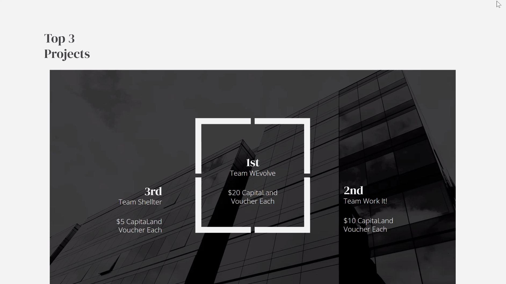

# (xīn) by Team WEvolve - Mental Wellness & Community App


## 🏆 **WINNER - Project Altair Hackathon 2021**



**xīn** (pronounced "sin") - *where the heart meets the soul*

A React Native mobile application focused on mental wellness, community support, and personal development. **Team WEvolve** secured **1st place** in the Project Altair Hackathon 2021 hosted by SIM Innovation and Networking Society (IONS). WEvolve provides a safe space for users to share their thoughts, connect with others, and explore various aspects of mental health and personal growth.

## 🏆 Achievements

### Project Altair Hackathon 2021 - **1st Place Winner**
- **Event**: Project Altair Hackathon 2021
- **Host**: SIM Innovation and Networking Society (IONS)
- **Achievement**: 🥇 **First Place**
- **Category**: Mental Wellness & Community App
- **Recognition**: Outstanding innovation in mental health technology

## 🌟 Features

### Core Functionality
- **Welcome & Authentication**: Beautiful onboarding experience with multiple sign-in options
- **Mood Tracking**: Daily mood meter to help users track their emotional state
- **Community Posts**: Share thoughts and experiences with a supportive community
- **Educational Content**: Access to information about various mental health topics
- **Personalized Recommendations**: Curated content based on user interests

### Mental Health Topics Covered
- Personality & Relationships
- Anger Management & Jealousy
- Depression & Anxiety
- Productivity & Procrastination
- Love & Confidence
- Mood Disorders & Childhood Issues
- Personal Development & Chronic Pain
- And many more...

## 🚀 Getting Started

### Prerequisites
- Node.js (v14 or higher)
- npm or yarn
- Expo CLI
- iOS Simulator (for iOS development) or Android Studio (for Android development)

### Installation

1. **Clone the repository**
   ```bash
   git clone <repository-url>
   cd xin
   ```

2. **Install dependencies**
   ```bash
   npm install
   ```

3. **Start the development server**
   ```bash
   npm start
   ```

4. **Run on specific platforms**
   ```bash
   # iOS
   npm run ios
   
   # Android
   npm run android
   
   # Web
   npm run web
   ```

## 📱 App Structure

### Navigation Flow
```
WelcomeScreen → LoginScreen → SignUpScreen → EmailSignUpScreen
     ↓
KnowAboutScreen → OthersScreen → HomeScreen
     ↓
PostScreen ↔ CommunityScreen
```

### Screen Descriptions

- **WelcomeScreen**: App introduction with pronunciation guide and call-to-action
- **LoginScreen**: Multiple authentication options (Facebook, Google, Apple, Email)
- **SignUpScreen**: User registration process
- **EmailSignUpScreen**: Email-based account creation
- **KnowAboutScreen**: Topic selection for personalized content
- **OthersScreen**: Additional customization options
- **HomeScreen**: Main dashboard with mood tracking and content recommendations
- **PostScreen**: Create and publish community posts
- **CommunityScreen**: View timeline and interact with community posts

## 🛠 Technology Stack

### Core Technologies
- **React Native**: 0.64.3
- **Expo**: ~44.0.0
- **React**: 17.0.1
- **React Navigation**: v6 (Stack Navigator)

### Key Dependencies
- `@react-navigation/native`: Navigation framework
- `@react-navigation/stack`: Stack navigation
- `react-native-gesture-handler`: Touch gestures
- `react-native-reanimated`: Animations
- `react-native-safe-area-context`: Safe area handling
- `react-native-screens`: Native screen optimization

### UI Components
- **Icons**: Expo Vector Icons (Ionicons, FontAwesome, Entypo, MaterialCommunityIcons)
- **Typography**: Custom font styling with ArialRoundedMTBold
- **Colors**: Warm, calming color palette (#f8f3ed, #3b475e, #032048, #FD6D4C)

## 🎨 Design Philosophy

### Color Scheme
- **Primary Background**: `#f8f3ed` (Warm cream)
- **Text Primary**: `#3b475e` (Deep blue-gray)
- **Accent**: `#FD6D4C` (Warm orange)
- **Action Button**: `#032048` (Dark blue)

### Typography
- **Primary Font**: ArialRoundedMTBold
- **Secondary Font**: Arial
- **Hierarchy**: Clear size differentiation (60px → 13px)

### User Experience
- **Calming Interface**: Soft colors and rounded corners
- **Intuitive Navigation**: Clear visual hierarchy and touch targets
- **Accessibility**: High contrast text and large touch areas
- **Emotional Support**: Encouraging messages and supportive language

## 📁 Project Structure

```
xin/
├── app/
│   └── screens/           # All application screens
│       ├── WelcomeScreen.js
│       ├── LoginScreen.js
│       ├── SignUpScreen.js
│       ├── EmailSignUpScreen.js
│       ├── KnowAboutScreen.js
│       ├── OthersScreen.js
│       ├── HomeScreen.js
│       ├── PostScreen.js
│       └── CommunityScreen.js
├── assets/
│   ├── fonts/             # Nunito font family
│   ├── icon.png
│   ├── splash.png
│   └── adaptive-icon.png
├── images/                # App images and graphics
├── App.js                 # Main application component
├── app.json              # Expo configuration
├── babel.config.js       # Babel configuration
├── react-native.config.js # React Native configuration
└── package.json          # Dependencies and scripts
```

## 🔧 Configuration

### Expo Configuration (`app.json`)
- **App Name**: WEvolve
- **Slug**: WEvolve
- **Version**: 1.0.0
- **Orientation**: Portrait
- **Platform Support**: iOS, Android, Web

### Font Configuration
The app uses custom Nunito fonts located in `assets/fonts/` with React Native font linking configured in `react-native.config.js`.

## 🚧 Development Notes

### Current State
- **Version**: 1.0.0 (Initial development)
- **Platform**: Cross-platform (iOS, Android, Web)
- **Navigation**: Stack-based navigation implemented
- **UI**: Complete screen designs with consistent styling

### Areas for Enhancement
- **Backend Integration**: Authentication and data persistence
- **Real-time Features**: Live community interactions
- **Push Notifications**: User engagement and reminders
- **Analytics**: User behavior tracking
- **Accessibility**: Screen reader support and keyboard navigation

## 🤝 Contributing

1. Fork the repository
2. Create a feature branch (`git checkout -b feature/amazing-feature`)
3. Commit your changes (`git commit -m 'Add some amazing feature'`)
4. Push to the branch (`git push origin feature/amazing-feature`)
5. Open a Pull Request

## 📄 License

This project is part of Project Altair Hackathon 2021 hosted by SIM Innovation and Networking Society (IONS) and is developed for educational purposes.

## 🙏 Acknowledgments

- **Project Altair Hackathon 2021**: SIM Innovation and Networking Society (IONS) for organizing this incredible competition
- **Mentor**: [Abhii Dabas](https://www.linkedin.com/in/abhii-dabas/) - For invaluable guidance and mentorship throughout the hackathon
- **Judges**: For recognizing our innovation in mental wellness technology
- **Mental Health Community**: For inspiration and support in creating meaningful solutions
- **React Native Community**: For excellent documentation and tools that made this project possible
- **Team WEvolve**: For the collaborative effort that led to this 1st place victory

---

**Remember**: This app is designed to support mental wellness. If you're experiencing a mental health crisis, please contact your local emergency services or a mental health professional.

*"Everything will be okay. You're not going through this alone."* - Team WEvolve
